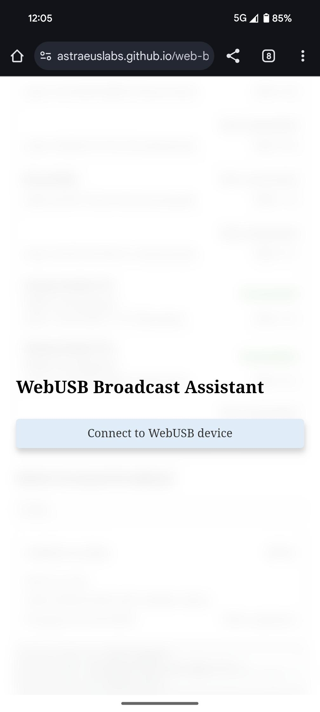
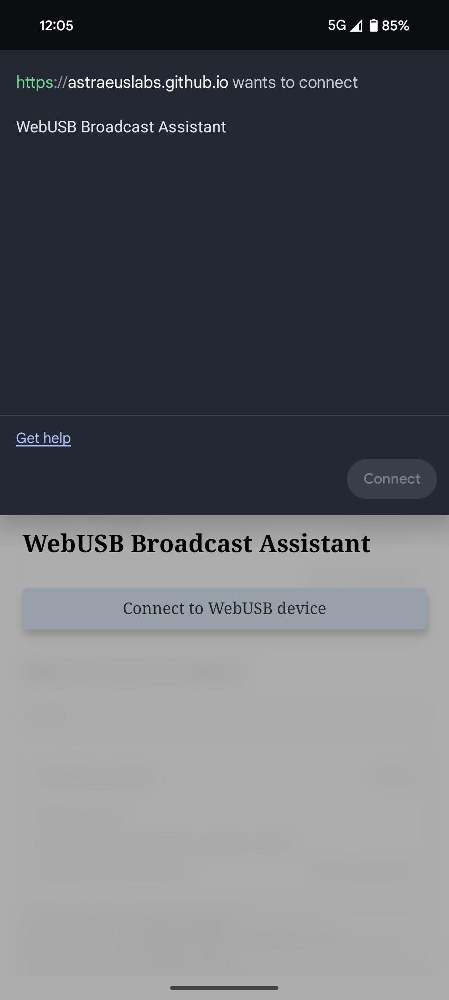
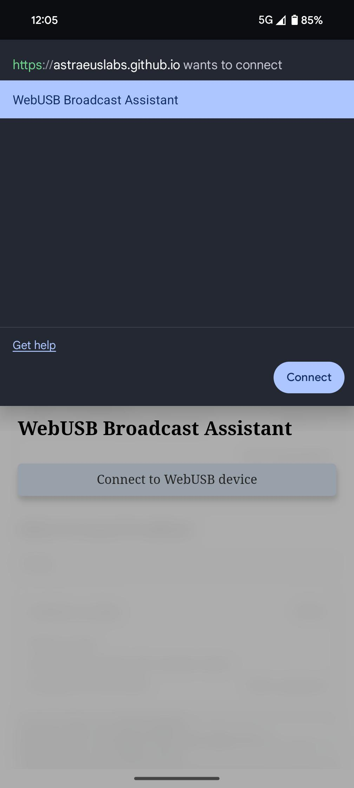
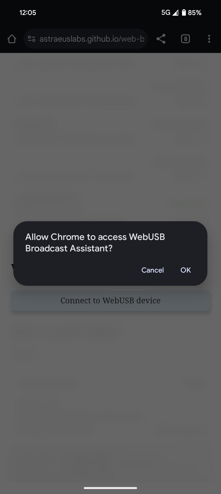
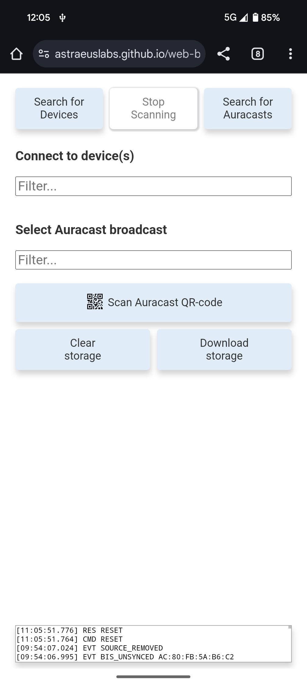

# Web Broadcast Assistant

## Starting the web application

Go to https://astraeuslabs.github.io/web-broadcast-assistant/?log=y&storage=y&details=y

> NOTE: The extra query parameters are there to enable additional febug features

The web page should now look like this:

Insert a dongle with the Web Assistant firmware and click `Connect to WebUSB Device`.

Now the browser will present a list of compatible USB devices found:

Select the `WebUSB Broadcast Assistant` device and press `connect` and allow access.

  &nbsp;&nbsp;&nbsp;
  

> NOTE: On mobile browsers, these steps are required every time.  On desktop, the permission granted is remembered and used on subsequent connects (and the application connectes immediately).

On successful connection, the web page should look like this:

## Main UI components

// TODO: image

### Extra options

By default, the UI interface is kept minimalistic to avoid too much clutter in the view.  However, when using the application under development, it's possible to enable additional details by adding query parameters in the URL bar.

#### Activity log

// TODO: image

Activated by adding __log=y__

A message and event activity log will appear in the bottom of the screen with a real time view of messages sent from the connected USB device.  It's possible to expand the view by hovering/clicking the activity log box.

#### Storage access

// TODO: image

Activated by adding __storage=y__

Every time the assistant does a PA sync to a broadcast source and receives BIGinfo and BASE information, this is stored together with the rest of the source information in the the brower's localstorage. This happens regardless of the "storage" feature being enabled or not.

When enabling this feature, two extra buttons will will appear in the bottom of the main UI:

* __Download__: Press this to download a JSON file containing all source entries in localstorage.  On desktop browsers, a download is initiated, on mobile browsers, the Web Share API is used.

* __Clear__: Clear all source entries in localstorage.

#### Detailed view

// TODO: image

Activated by adding __details=y__

When this feature is enabled, more details will be visible for both broadcast source and sink entries. Also, a filter input option will appear for both sink and source lists.

## Search for devices (Broadcast Sinks)

// TODO: image

Click __Search for Devices__ to start scanning for broadcast sinks.  When the desired devices appear in the list, click __Stop scanning__.

## Search for Auracasts (Broadcast Sources)

// TODO: image

Click __Search for Auracasts__ to start scanning for broadcast sources.  Every time a valid broadcast source is found (matching criteria in the extended advertising fields), it's added to the list.  At the same time, the firmware tries to do a PA sync to obtain the BIGinfo and BASE.  Once this happens, more details are added to the broadcast source entry, containing information on e.g. subgroups, sampling frequencies, encryption.

## Standard flow

* Search for Auracasts (Broadcast sources)
* Stop scanning (when the desired sources are listed and PA sync'ed)
* Search for Devices (Broadcast Sinks)
* Stop scanning (when the desired sinks are listed)
* Connect to the desired sink(s) (e.g. earbuds).
  * NOTE: If the connected device is part of a coordinated set (CSIP), the application will ask if the full set should be connected.  If this is not present or fails, the user can always manually connect an additonal device by clicking on it in the list.
* When successfully connected, select a source to play.  If the source has multiple subgroups, first select the desired subgroup to sync to.
* Wait for the connected devices to report back that they are synced and audio should be playing.

// TODO: image
